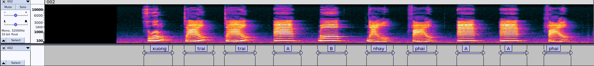
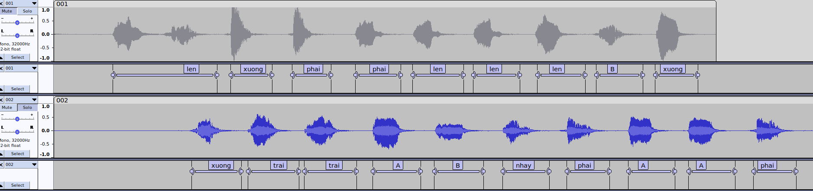

# Auto labeling tool  
Đây là tool gán nhãn tự động dựa trên mô hình VAD cho bài tập thu âm và gán nhãn, lớp học phần INT3411.  

***Miễn trừ trách nhiệm***: Đây là mini project cho những ai lười (như mình) và không đảm bảo sự chính xác tuyệt đối. Cần cẩn trọng khi sử dụng.  

## Installation  
Chuẩn bị môi trường Python 3.6+ (khuyến khích sử dụng virtualenv hoặc conda), chạy các câu lệnh sau:
```bash
pip install webrtcvad
pip install unidecode       # Optional, only for normalizing text label
pip install vietnam-number  # Optional, only for normalizing number label

git clone https://github.com/thanhtvt/auto-labeling-int3411.git
```  
  
## Usage  
Di chuyển đến `src/` và chạy lệnh  
```bash
python3 label_generator.py [-a <aggressive>] [-s] <input_wavs> <input_labels>  
```
Trong đó:
- `aggressive`: độ "chặt" của thuật toán xác định vùng có tiếng nói (0 - 3). Càng cao thì thuật toán càng chặt chẽ (Mặc định là 3).  
- `-s`: sử dụng flag này để label cả những đoạn sil (chưa hỗ trợ vì chủ repo lười).  
- `input_wavs`: directory chứa các file audio .wav cần gán nhãn (hỗ trợ cả với 1 file audio duy nhất).  
- `input_labels`: file .txt chứa các label cần gán nhãn.  
  
Ví dụ: `python3 label_generator.py ../example ../example/label.txt`  
  
Output là các file text, môi file text chứa label của audio tương ứng theo format:
```
3.090000	4.140000	xuong
4.350000	5.430000	trai
5.610000	6.720000	trai
7.140000	8.160000	A
8.520000	9.570000	B
10.050000	11.040000	nhay
11.490000	12.390000	phai
12.870000	13.860000	A
14.220000	15.210000	A
15.690000	16.590000	phai
```  
  
Demo kết quả:  


## Notes  
1. Mô hình VAD chỉ nhận các audio có giá trị `sample rate` là một trong các số `[8000, 16000, 32000, 48000]`. Vậy nên, khi thu âm cần thu âm với tần số là 1 trong 4 số kia (lớn hơn số yêu cầu) và downsample sau đó (không được thu âm với tần số nhỏ hơn rồi upsample vì theo [định lý Nyquist-Shannon](https://en.wikipedia.org/wiki/Nyquist%E2%80%93Shannon_sampling_theorem)). Ví dụ, nếu yêu cầu thu âm với tần số 22050 Hz thì ta thu 32000 Hz rồi sau sẽ downsample xuống.  

2. Có thể chạy lệnh sau để resample về đúng tần số yêu cầu. Trong đó `<inp_sr>` là sample rate ban đầu, `<out_sr>` là sample rate đầu ra, `<data>` có thể là folder chứa tập các audio input hoặc 1 audio.  
```
python3 resample.py <inp_sr> <out_sr> <data> 
```  
Ví dụ: `python3 resample.py 32000 22050 ../example`  

**Lưu ý**: cần tải sox về để chạy script (link tải cho [Windows](https://sourceforge.net/projects/sox/), [Linux & MacOS](https://arielvb.readthedocs.io/en/latest/docs/commandline/sox.html))  

  
3. Khi thu âm, cần thu trong môi trường **yên tĩnh**, mỗi từ nói ra cần **ngắt một khoảng** nhất định rồi mới nói tiếp. Phát âm to, rõ ràng, ít nhiễu sẽ đẩy độ chính xác lên mức tốt nhất. Ví dụ như hình dưới, câu trên do không ngắt đủ dài nên gán 2 từ thành 1, dẫn đến lệch các từ sau.  
  
  
3. Tips cho các bạn không thể thu âm trong môi trường yên tĩnh hoàn toàn. [Audacity](https://www.audacityteam.org/) có hỗ trợ tính năng `noise reduction`. Cụ thể cách sử dụng tham khảo ở [đây](https://manual.audacityteam.org/man/noise_reduction.html). Tuy nhiên nó cũng sẽ làm giọng bạn hơi thay đổi đi một chút, mức độ thì tùy độ nhiễu của audio.  
  
4. Nên test với một vài audio để tìm ra cách đọc, ngắt nghỉ để phù hợp với tool trước khi chạy hết với toàn bộ tập dữ liệu.  
  
5. Chú ý khi đặt tên audio: Nên đặt theo dạng `001.wav`, `002.wav`, ... Miễn làm sao cho thứ tự khi sắp xếp tăng dần của chúng trùng với thứ tự label tương ứng trong file text chứa nhãn.
    
## Credits
1. https://github.com/wiseman/py-webrtcvad